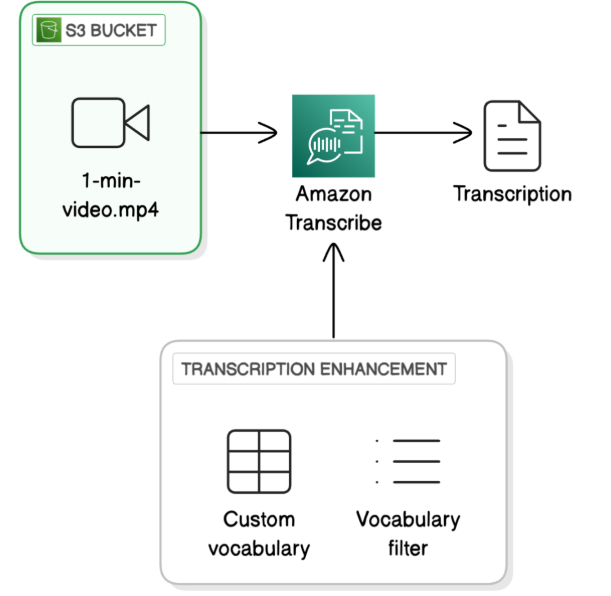

# 🎧 Audio/Video Transcriber with Amazon Transcribe

This project explores how AI services like **Amazon Transcribe** can be used to generate accurate text transcriptions from audio or video content stored in **Amazon S3**. It is aimed at improving accessibility, supporting voice-command features, and understanding the transcription pipeline using AWS.

---

## 📄 Project Documentation

Find the full documentation with slides, explanations, and outputs here:  
👉 [View Documentation PDF](Kanika's%20Documentation%20for%20audiovideo%20transcribe%20with%20AI.pdf)

---

## 🧠 Key Concepts Covered

- **Amazon Transcribe**: AWS's automatic speech recognition (ASR) service
- **Amazon S3**: For storing the input media files
- **Speaker Identification**: Labeling speakers as Speaker 0, Speaker 1, etc.
- **Custom Vocabulary**: Improve transcription accuracy for specific words
- **Vocabulary Filtering**: Remove or mask unwanted words like fillers
- **Real-Time Transcription**: Live transcription as the audio is streamed
- **Subtitle Output**: Generation of timestamped text for SRT/WebVTT

---

## 🗂️ Architecture Diagram

---

## Connect with me 

**Kanika Mathur**  
- [E-mail](mkanika.90@gmail.com)
- [GitHub](https://github.com/KanikaGenesis)  
- [LinkedIn](https://www.linkedin.com/in/kanika-mathur-083080121)  

---
